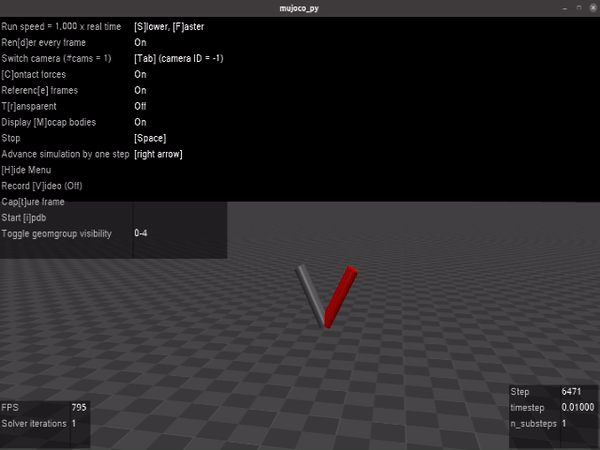

# Two Link Arm Control Using Jacobian
This project realizes a simple jacobian based controller for a two-link arm.

## Jacobian-based control
The position of the gripper in the world can be given by:

  

 is the pose in the world.
It has the size 7 if quaternions are used to represent rotations.

The jacobian is obtained by deriving the forward kinematics equations:

  

The jacobian links the speed of the joints the speed of the end-effector:

  

For a desired end-effector speed, 
the speed with which the robot joints must be commanded, 
can be obtained by inverting the jacobian.

### remember:
- The jacobian matrix  
doesn't have to be square (the speed vector is of the size 6 
where the joint speed can have a different size depending on the number of joints).
- The singularities of the jacobian are **real**: it is not possible 
to move the robot arm in a specific direction with a speed different the zero.
- The joint speeds to move the end-effector become large near the singularities. 
This can be solved by combining the jacobian and optimal control.

## This repository:
The forward kinematics are calculated and differentiated using sympy. 
This results in an analytical formulation of the jacobian, 
which can be evaluated at every time step using the joint positions.
For stability (even in simulation) the desired joint positions should be used instead of the measured positions.
("Think of the trajectory as if it were playing out").
The pseudo inverse is calculated (it gives the minimum norm solution).

### Goal:
Use the jacobian controlled to move the robot arm on a horizontal line back and forth.
This directly results in the desired velocities: 
 
and .

Note: that A is the amplitude of the speed of the end-effector and not the range of movement.

 ### Problem:
When the controlled based on the pseudo inverse of the jacobian doesn't 
account for limits on the joint speeds. 
"Your Robot will break before you loose rank" (Russ Tedrake).

